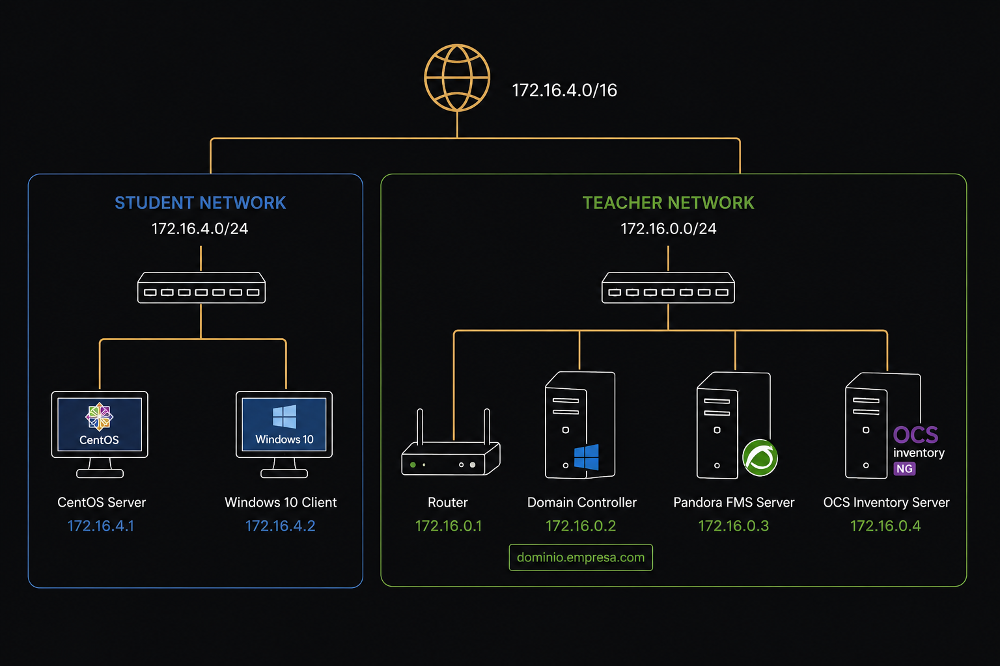

# Systems Infrastructure Lab

A hands-on systems administration and infrastructure project developed between November 2017 and April 2018.

The project uses virtual machines and classroom infrastructure to build and configure a mixed Linux and Windows environment, covering storage, networking, security, services, backups, monitoring, inventory, automation and Active Directory integration.

## Overview

The project was developed as the final project for a Systems Administration course at Dicampus.

Its objective was to bring together the administration and configuration tasks covered throughout the course into a practical infrastructure environment, using both Linux and Windows systems.

The main Linux environment was built on **CentOS 7** running as a virtual machine in Oracle VM VirtualBox. A Windows 10 virtual machine and shared classroom infrastructure were used to implement domain services and integrate the Linux environment with a Windows domain.

## Architecture

The project was built around a small virtualized environment connected to the classroom infrastructure.

The student environment consisted of a **CentOS 7 server** and a **Windows 10 workstation**, while shared classroom services provided domain management, monitoring and inventory.



## Infrastructure

The main Linux virtual machine was configured with:

* CentOS 7.1708
* 2 GB RAM
* 1 system disk
* 2 additional disks for redundant storage
* Static network configuration
* Remote administration through SSH

The two additional disks were configured as a **RAID 1** array using `mdadm`. LVM was then configured on top of the RAID device, with the resulting logical volume formatted using XFS.

```text
Virtual disks
    │
    ├── /dev/sdb1
    └── /dev/sdc1
           │
           ▼
        RAID 1
        /dev/md0
           │
           ▼
          LVM
         vg1/lv1
           │
           ▼
          XFS
           │
           ▼
      /media/datos
```

## Linux

The Linux environment covers several areas of systems administration:

### System administration

* CentOS 7 installation and initial configuration
* Static network configuration
* Package and system updates
* SSH server configuration
* Remote administration

### Storage

* Disk partitioning with `gdisk`
* RAID 1 configuration with `mdadm`
* LVM configuration
* XFS filesystem
* Persistent mounting through `/etc/fstab`

### Security

* SSH configuration hardening
* Fail2ban configuration
* Firewall configuration
* SELinux-related Samba configuration
* MySQL secure installation

### Web stack

A complete web application stack was configured using:

* Apache HTTP Server
* MySQL
* PHP
* WordPress
* phpMyAdmin

### File services

Samba was configured to provide shared storage with:

* Users and groups
* Access permissions
* Shared directories
* SMB3
* Firewall integration
* Samba logging
* Windows domain integration

### Backup and automation

The project also includes:

* `rsnapshot` for filesystem snapshots
* Scheduled backups using cron
* Bash scripting
* Automated Samba user creation

### Monitoring and inventory

The Linux system was integrated with:

* Pandora FMS
* OCS Inventory

## Windows

The project also includes Windows-based infrastructure.

### Windows 10

A Windows 10 virtual machine was configured to:

* Join the Windows domain
* Use the project network configuration
* Connect to the Linux/Samba infrastructure
* Run the Pandora FMS agent
* Run the OCS Inventory agent

### Windows Server 2012

A Windows Server 2012 environment was used for domain administration, including:

* Organizational Units
* Users and groups
* Group Policy
* Network drive assignments
* Active Directory domain services

The CentOS system was subsequently integrated with the Windows domain so that domain users could access Samba shares using their existing Windows identities and groups.

## Technologies & Tools

| Area                    | Technologies                                      |
| ----------------------- | ------------------------------------------------- |
| Virtualization          | Oracle VM VirtualBox                              |
| Linux                   | CentOS 7                                          |
| Windows                 | Windows 10, Windows Server 2012                   |
| Storage                 | mdadm, RAID 1, LVM, XFS                           |
| Networking              | TCP/IP, static addressing, firewall configuration |
| Remote administration   | SSH, PuTTY, KeePass                               |
| Web                     | Apache, PHP, MySQL, WordPress                     |
| Database administration | phpMyAdmin                                        |
| File sharing            | Samba, SMB3                                       |
| Security                | Fail2ban, firewall, SELinux                       |
| Backup                  | rsnapshot, cron                                   |
| Automation              | Bash scripting                                    |
| Monitoring              | Pandora FMS                                       |
| Inventory               | OCS Inventory                                     |
| Directory services      | Active Directory, GPO, SSSD, realmd               |

## Documentation

The complete original project report is available here:

**[Project Report](./docs/project-report.pdf)**

The report contains the original technical documentation produced in 2018, including the configuration and implementation process, command references and screenshots.

## Project Context

This project was completed on **6 April 2018** as the final project for a Systems Administration course at Dicampus, following coursework carried out between November 2017 and April 2018.

It is preserved in its original context as a record of an early stage of my work in systems administration and infrastructure.

The technologies and configuration approaches reflect the infrastructure practices and learning environment of that period. The project is therefore presented as a historical technical project rather than as a current production reference architecture.

## From Systems Administration to Cloud

This project represents an early stage of my infrastructure journey.

Working with operating systems, storage, networking, security, services, monitoring, backups, automation and Windows/Linux integration provided the foundation for my continued development toward **Cloud, automation and DevOps**.

---

**Year:** 2018
**Focus:** Systems Administration · Infrastructure · Linux · Windows · Virtualization · Storage · Security · Monitoring · Automation
